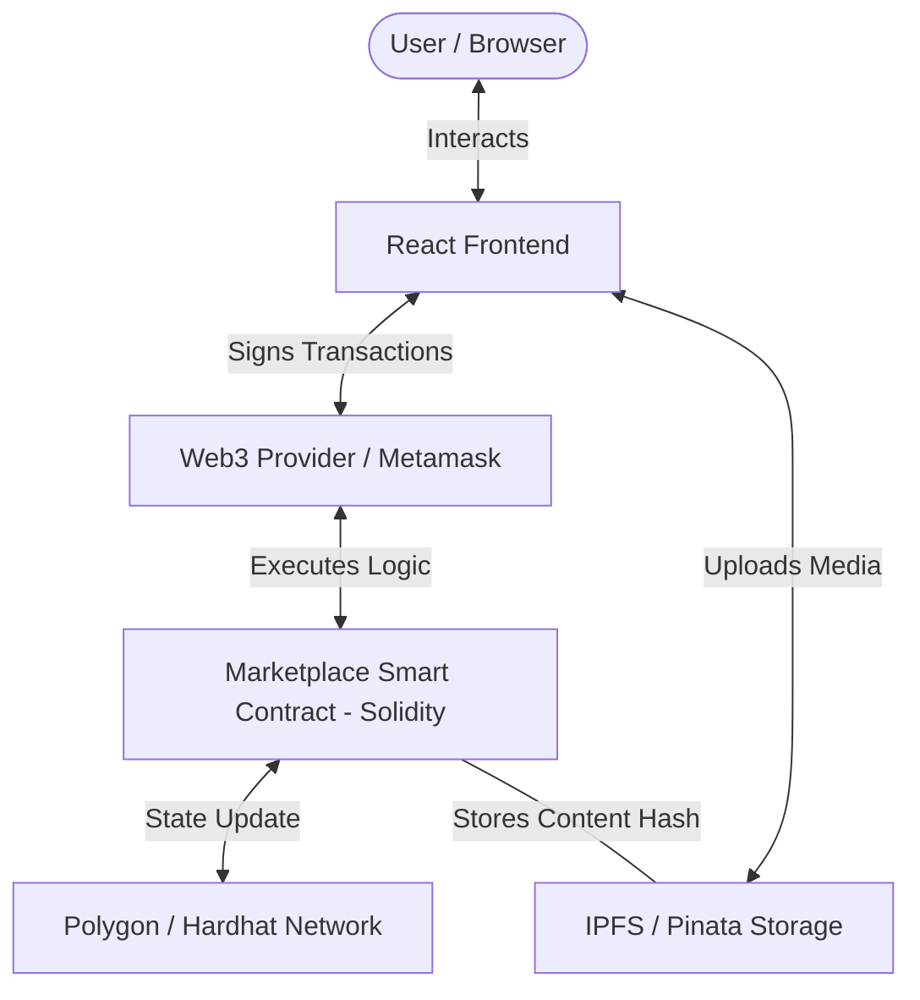

# 🖼️ ApnaMarketDotNFT - Decentralized NFT Marketplace

[](https://hardhat.org/)
[](https://reactjs.org/)
[](https://docs.soliditylang.org/)
[](https://tailwindcss.com/)
[](https://polygon.technology/)

ApnaMarketDotNFT is a professional, full-stack decentralized application (DApp) that enables users to mint, buy, and sell NFTs. Built with a focus on a seamless user experience and secure smart contract interactions, it leverages the Polygon network for fast and low-cost transactions and IPFS for decentralized storage.

---

## 🏗️ System Architecture

The following diagram illustrates the high-level flow and interaction of the system components:



---

## 📸 Media Gallery

### Demo Video

[🎥 Watch the Video Demo](https://drive.google.com/file/d/18AWDANhani3GURWlwi4_qvxVUOPRtgOY/view?usp=sharing)

### Project Walkthrough

|                 Marketplace View                  |                   NFT Selection                   |
| :-----------------------------------------------: | :-----------------------------------------------: |
|  |  |

|                    Create NFT                     |                   My Collection                   |
| :-----------------------------------------------: | :-----------------------------------------------: |
|  |  |

---

## 📚 Educational Context: Web3 Demystified

### 🌐 What is a DApp (Decentralized Application)?

Unlike traditional apps (like Instagram or Uber) which are controlled by a central company, a **DApp** runs on a decentralized network (blockchain). No single entity has total control, making it censorship-resistant and transparent.

### 🪙 What is Cryptocurrency?

**Cryptocurrency** is a digital or virtual currency that uses cryptography for security. In this marketplace, we use tokens (like MATIC on Polygon) to facilitate transactions between buyers and sellers without a middleman like a bank.

### ⛓️ What are Blockchain Networks?

A **Blockchain** is a distributed ledger that records all transactions across a network of computers. Networks like **Polygon** (which this project uses) are "Layer 2" solutions that sit on top of Ethereum to provide faster speeds and significantly lower "Gas Fees" (transaction costs).

---

## 🚀 Key Features

- **🎨 Minting (Create)**: Upload your artwork and metadata to IPFS and mint a unique NFT on the blockchain.
- **🛒 Buy/Sell Marketplace**: List your NFTs for sale with a custom price or browse and purchase items listed by others.
- **📊 Dashboard & Profile**: Track your owned NFTs, view your transaction history, and check your wallet balance.
- **🔄 Cancel Listings**: Change your mind? Cancel any active listing to return the NFT to your personal collection.
- **⚡ High Performance**: Optimized for the Polygon network to ensure near-instant transactions.

---

## 🛠️ Technology Stack

| Layer               | Technology                               |
| :------------------ | :--------------------------------------- |
| **Frontend**        | React, Tailwind CSS, React Router, Axios |
| **Smart Contracts** | Solidity, OpenZeppelin                   |
| **Development**     | Hardhat, Ethers.js                       |
| **Storage**         | IPFS (Pinata)                            |
| **Blockchain**      | Polygon (Mumbai Testnet), Hardhat PC     |
| **Wallet**          | Metamask, Web3Modal                      |

---

## ⚙️ Setup & Installation

### Prerequisites

- [Node.js](https://nodejs.org/) (v16+ recommended)
- [Metamask Wallet](https://metamask.io/)
- Hardhat installed globally: `npm install --save-dev hardhat`

### 1. Clone the Repository

```bash
git clone https://github.com/Harshstag/ApnaMarketDotNFT.git
cd ApnaMarketDotNFT
```

### 2. Install Dependencies

```bash
npm install
```

### 3. Environment Configuration

Create a `.env` file in the root directory and add your credentials:

```env
REACT_APP_PINATA_KEY=your_pinata_api_key
REACT_APP_PINATA_SECRET=your_pinata_secret
PRIVATE_KEY=your_metamask_private_key
RPC_URL=your_alchemy_or_infura_url
```

### 4. Deploy Smart Contracts

```bash
npx hardhat run scripts/deploy.js --network mumbai
```

### 5. Start the Application

```bash
npm start
```

The app will be available at `http://localhost:3000`.

---

## 📄 License

This project is licensed under the MIT License - see the LICENSE file for details.

---

_Created with ❤️ by Harsh Singh (HarshStag)._
